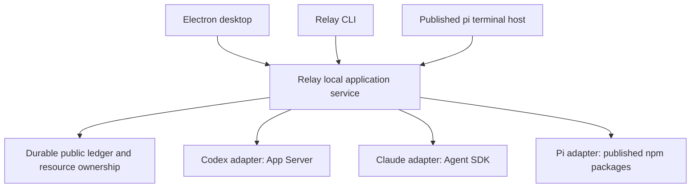

# Relay architecture

Relay is an application around native coding runtimes, not another agent loop.
The repository contains an Electron app and a shared application package.

## Layout and ownership

```text
apps/desktop/
  src/                  Electron main, preload, and application worker
  ui/                   Conversation, settings, accounts, files, code, and timeline UI
  scripts/              Development launcher, preview, and dependency assets
  test/                 Renderer behavior
packages/core/
  src/
    contracts.ts        Shared session, event, approval, task, and runtime contracts
    service/            Local service owner, client, protocol, and recovery
    sessions/           Public ledger, attachments, and history
    storage/            Durable writes
    runtimes/
      codex/            Codex App Server protocol integration
      claude/           Claude Agent SDK integration
      pi/               Published pi SDK integration
    handoffs/           Bounded public context passed between runtimes
    resources/          Workspace and configured resource ownership
    permissions/        Tool approval policy
    tasks/              Delegated task reports
    accounts/           Credential-reading helpers
    desktop/            Product accounts, imports, timeline, search, editing, projection
    terminal/           Published pi terminal host and native runtime display
    cli.ts              Relay CLI and JSONL RPC entry
    index.ts            Shared exports
  test/                 Offline service, adapters, and product regressions
scripts/                Workspace-wide checks and test runner
```

Executable desktop code belongs under `apps`; shared behavior belongs in `packages/core`.
The CLI and terminal are thin service clients inside core; separate workspaces are
unnecessary until they need independent packaging. Core cannot import desktop app code.
Desktop imports declared `@relay/core` exports rather than reaching through relative
paths into another workspace. Both workspaces are private.



## Why these boundaries exist

A Desktop conversation must remain available when its window closes and the CLI opens.
The local service therefore owns identity, selections, public history, approvals,
tasks, and recovery. Electron owns presentation and operating-system integration.

When Codex writes a file and the user switches to Claude, Relay retains the public
result and supplies missing context to Claude. Claude opens its own native record
against the same workspace. It does not resume Codex's private state or replay its
completed tool calls. Every backend owns its own requests, tools, compaction, and
native transcripts.

The ledger is separate from backend journals and UI preferences. Appends are serialized
and synced. Stable operation IDs prevent duplicate controlled execution; uncertain
acceptance is not retried automatically. Interrupted work is quarantined until the
operator inspects effects and reconciles it. Cancellation requests and verified
settlement are separate outcomes.

Published pi packages provide the loop, provider APIs, credentials, tools, and rich
terminal. No local `ai`, `agent`, `coding-agent`, or `tui` workspace remains. The
`pi-sdk`, `pi-ai`, and `pi-tui` aliases resolve installed npm packages. The boundary
check rejects private pi entries, direct upstream imports, and inline imports.
Desktop Markdown, syntax highlighting, and diff assets come from its own dependencies.

## Validation and limitations

`npm run check` covers both workspaces and resolves the renderer and Electron entry
points. `./test.sh` discovers offline Relay tests, isolates user resources and provider
credentials, and runs node:test plus the focused desktop Vitest tests. Adapter tests
use mock backends and published pi's faux provider; they make no paid provider calls.

Offline tests do not validate live Codex/Claude inference, Electron rendering, actual
subscription exhaustion, or exhaustive upstream extension/RPC/export/share behavior.
The legacy CLI and local model generation/build pipeline have been removed by request;
their source is not retained as a fallback. Published pi behavior is authoritative.

Native tools have different approval and sandbox semantics. Claude/pi tool hooks are
not OS sandboxes. Trusted extensions and project hooks execute code. Unsupported native
approval requests fail explicitly; a generic dialog cannot implement every protocol.
Native steering into a running Codex/Claude turn is not implemented. Former pi-specific
Codex manual redirect handling has no verified native equivalent; native browser/device
login is available.

Workspace/resource ownership is cooperative, not remote process fencing. Windows
subprocess settlement remains conservative. Unknown work retains ownership. Git
snapshots are observed states, not guaranteed synchronous barriers before native tools.
Context handoffs are bounded public evidence, not portable hidden reasoning. Very large
conversations remain limited by in-memory projections and 16 MiB transport frames.

See [core operations](../packages/core/README.md) for recovery and worker configuration.
