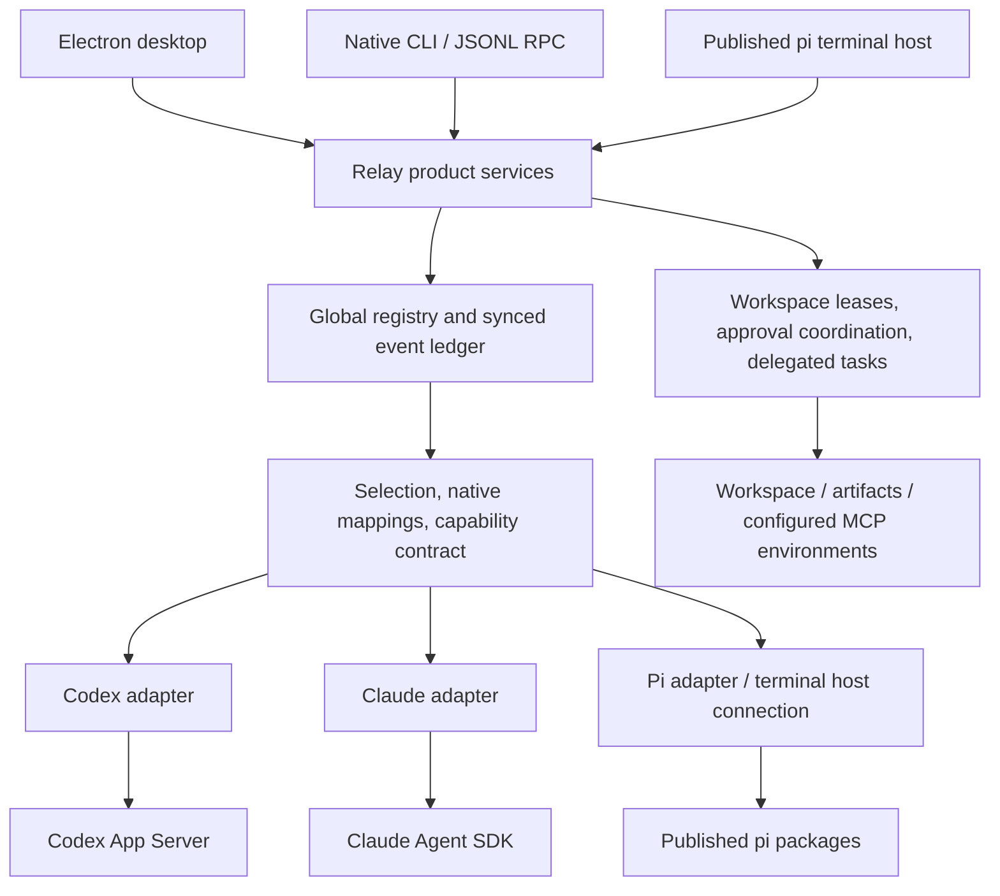

# Native runtime migration: implementation and remaining gates

Desktop, the native CLI, and the default terminal (`npm start`) now use `packages/app` and supported native runtimes. This is an application cutover, not full fork source retirement. The legacy CLI is explicitly available as `npm run start:legacy`; its workspaces and tests remain while the documented preservation gaps are closed. Their retention is tied to those concrete gates, not hypothetical package compatibility.

## Findings and ownership

The original root README was stale: `packages/desktop` already contained a working Electron shell, account/profile management, native-session discovery/import, model selection, file editing, Git timeline/history, snapshot review, usage controls, and persisted settings. Those features are implementation, not just proposals. The original desktop engine lived under `packages/coding-agent/src/desktop`; it mixed shared history with local pi execution and Claude execution. The application extraction moves its product modules into `packages/app/src/desktop` and replaces its engine with a presentation bridge.

The retained fork has real providers/auth/streaming (`packages/ai/src`), a real loop/tool state (`packages/agent/src`), session persistence/extensions/CLI modes (`packages/coding-agent/src/core`, `src/modes`, `src/cli.ts`), and terminal rendering (`packages/tui/src`). Removed experimental protocol/server/client packages, durable runtimes, Chord, telemetry, evals, MCP, codemode, and built-in extensions were not working features of this fork. Upstream documentation referring to them is not evidence they still exist here. Published pi 1.1.0 brings some of those packages transitively; the new host disables removed builtins explicitly.

Relay owns identity, public history, selections, context handoffs, tasks, approvals, resource coordination, recovery, and frontend projection. Backends own native loops, requests, model formats, tools, compaction, native persistence, and streaming. Relay normalizes only observable product events. It does not translate foreign tool calls into executable requests or reconstruct a backend loop.

`packages/app/src` layout:

| Module | Responsibility |
| --- | --- |
| `contracts.ts` | Relay session, native mapping, lifecycle, event, approval, task, handoff, and result contracts. |
| `service/{application,server,client,protocol,hosted,paths}.ts` | Single local owner, authenticated transport, validation, frontend-hosted execution, recovery. |
| `sessions/ledger.ts`, `storage/durable.ts` | Append-only product history, projections, synced private writes. |
| `runtimes/{codex,claude,pi}` | Native protocol/SDK integration; useful backend metadata remains here. |
| `runtimes/process-group.ts` | Verify local subprocess group settlement before ownership release. |
| `handoffs/context.ts` | Deterministic public context selection; no summarizer agent loop. |
| `resources/leases.ts`, `permissions/gate.ts`, `tasks/report.ts` | Cooperative ownership, tool policy, structured untrusted reports. |
| `desktop` | Accounts, imports, projections, timeline, explorer/search/editor, login/usage. |
| `terminal/{main,host,native,sessions}.ts`, `cli.ts` | Published pi frontend and Relay native CLI. |

`scripts/check-relay-boundaries.mjs` rejects local fork imports, direct workspace-name imports, private pi paths, and inline imports from app/desktop source. It validates exported aliases against installed package manifests. App/desktop have an isolated TypeScript check so root workspace path aliases cannot resolve their types back to the fork.

## Feature preservation matrix

“Implemented” here describes code and listed offline checks. It does not imply live provider or Electron validation of the new path. “Gate” means known work remains; the corresponding legacy behavior has not been removed.

| Feature | Original implementation | Target owner / backend differences | Migration and current status | Validation |
| --- | --- | --- | --- | --- |
| Conversation, session identity and resume | `coding-agent/src/core/{agent-session,session-manager}.ts`; desktop `store.ts` | Relay public history; each runtime resumes only its own native records | Global JSONL ledger, multiple mappings, stable operation IDs, desktop projection/import; implemented | `application`, `desktop`, `service` tests |
| Global discovery across frontends | Desktop-local library and native importer, no global service | Relay; no provider thread portability | Shared service directory, registry/list/get and broadcast; implemented | Two-client socket test, CLI-session desktop discovery |
| Runtime/model/provider selection | `ai/src`, core model runtime, desktop `accounts.ts`/`runtime.ts` | Relay selection, native model validity/catalogs | Codex routes native; Claude SDK; general models public pi. Backend options remain discriminated | `application`, `protocol`, `desktop` tests; live model parity gate |
| Multiple accounts and quota fallback | Desktop login/accounts/usage/runtime | Relay account ordering; quota signals differ | Product logic extracted; native completed effects precede continuation. Generic 429s do not rotate | `desktop-product` fallback test; actual subscription exhaustion untested |
| Authentication and credential storage | `ai/src/oauth.ts`, credential adapters; desktop isolated profiles/login | Native profiles and published pi credentials; OS stores differ | Public credential APIs; profiles outside history; unknown selection fields stripped | Protocol secret-field and migrated account/login/usage tests; native browser/device login uses synthetic CLI. Live verification and former Codex manual redirect compatibility remain gates |
| Streaming text/tool progress | Agent events; desktop engines; TUI components | Relay normalized events, native granularities differ | Adapter text/tool/progress/outcomes and frontend projection; implemented | `adapters`, `terminal`, `desktop` tests; visual native QA gate |
| Read/bash/edit/write; extra search/list tools | `coding-agent/src/core/tools`, terminal `!`/`!!` | Native tools; public pi supplies existing general-model tools | No copied tools/loop in app; public pi hooks await durable boundaries. User shell wrapped in lease | Faux provider write/resume tests; shell/process cleanup coverage partial |
| Manual file editor | Desktop `workspace.ts`/`runtime.ts`; explicit save and stale-content checks | Relay application writer | Shared lease, prepared/completed/unknown journal, original containment/save checks retained | `desktop` editor lease and uncertain-save tests |
| Cancellation and interactive control | Agent abort; TUI keybindings, steer/follow-up; desktop Stop/account switch | Relay propagation; native interruption is not proof of settlement | Parent/child cancellation, uncertain outcomes quarantine; published pi retains controls | Delegation cancel, disconnect, unfinished tools, surviving-child and bounded uncooperative settlement tests. Native steering/follow-up equivalence remains a gate |
| Approval modes | Desktop Ask/Allow edits/Read only and run allowance | Relay presentation plus native enforcement | Scoped dialogs, two-minute expiry, native policies/hooks; read-only path checks. No universal security promise | `approvals`, `protocol`, `adapters`, `desktop-product` tests |
| Context management/compaction | Core compaction and branch summarization; desktop shared context bound | Backend native compaction; Relay public ledger survives | Public native summaries excluded from portable hidden state; bounded deterministic handoffs (96 KiB event budget) | Switching/compaction tests; scoped public-history and attachment retrieval via native read tools; no paid context-quality evaluation |
| Branch/new/resume/tree navigation | `session-manager.ts`, `agent-session.ts`, interactive session/tree selectors | Relay lineage plus native branches | Terminal new/fork/resume/tree maps Relay lineage and imports selected public branch messages, outcomes, images, and artifact references. Workspace changes are not rolled back by conversation navigation | `terminal-sessions` tests including foreign evidence, branch exclusion, and attachment capture/digest verification |
| Export/share/replay | Core session/HTML export, interactive session-share, JSON/RPC modes | Relay ledger export; pi owns native HTML/sharing | Relay JSON export/read-only replay; native pi HTML export through public main. Network sharing behavior not portably normalized | CLI help/offline checks; full export/share compatibility gate |
| Extensions and custom tools/providers | Core extension loader/runner/wrapper/public API | Public pi extension points; Codex/Claude have their own mechanisms | Public loader, policy hooks after user mutation, rich UI in pi terminal. No cross-runtime extension execution emulation | Faux pi extension/host tests; provider registration before lookup and public trust handlers/stored denials verified. Full legacy extension API compatibility remains a gate |
| Skills, prompt templates, project instructions | `skills.ts`, `prompt-templates.ts`, resource loader/system prompt | Backend-native loading; Relay handoff carries public constraints | Public pi flags/resource loaders; Claude setting sources option; native Codex project instructions. No identical semantics promised | TS/public types and trust callback tests; full resource precedence across native backends remains a gate |
| Terminal rendering and configuration | `packages/tui`, interactive components/themes/editor/keybindings | Published pi UI plus Relay native CLI | Rich terminal via public `InteractiveMode`; no copied TUI internals. Same-terminal Codex/Claude/pi routing, public replay, live widget and configurable native cancellation implemented | Real public pi TUI-hook integration plus controller/restart/keybinding tests; native interactive visual QA remains a gate |
| Print/JSON/RPC/external SDK | Print mode, JSONL RPC, public SDK exports | Public pi modes; new Relay protocol version 1 | Separate pi-native and Relay-global protocols; public pi lifecycle wrappers | `hosted`, `terminal`, `service`, boundary tests; exhaustive old RPC command gate |
| CLI attachments, tools, scoped models, reasoning level | CLI args, image handling, model scope, core tool config | Backend-specific; hidden reasoning excluded from Relay | Published pi flags passed through. CLI/terminal capture verified images/text; native image inputs, branch copying and artifact handoffs implemented. Prior images are references, not automatically resubmitted image blocks | Real faux pi image/text-only rejection, mocked native image payloads, restart/digest/path and selected-branch attachment tests |
| Session import/discovery/display filtering | Desktop native Codex JSONL/Claude SDK importer | Relay public import; never native-session takeover | Extracted importer, stable identities, no private reasoning or original transcript writes | Migrated importer regressions, public-history continuation filtering and source transcript preservation tests |
| Desktop projects/library/settings/layout | Electron main/preload/UI; persisted appearance/sidebar/options/shortcuts | Relay frontend | UI retained; worker uses application bridge, account/session controls unchanged | Root browser smoke; native Electron QA of new bridge gate |
| Git timeline/history/snapshot review | Desktop timeline/history/search/workspace/runtime | Relay product; snapshots are observed states | Product modules extracted, notes global, reviews separate linked native sessions and exports. Native asynchronous events cannot guarantee exact pre-tool snapshots | `desktop-product` HEAD/index/transient-file test; native snapshot timing gate |
| Inspector Files/Code/Changes/search/blame | Desktop workspace/search/timeline/history UI | Relay application modules | Extracted implementation retains bounded search, full historical trees, line provenance | Migrated explorer/search, containment, timeline-option and read-only regressions against new application modules |
| Removed runtime/MCP/codemode/telemetry features | Root removal statement; residual upstream docs | Explicit native MCP proposal only | No restoration of old experimental framework. Native worker MCP is new explicit integration; terminal telemetry off | Config validation and worker tests; packaged transitive review required |

## Core contracts and invariants

`RelaySession` contains ID, canonical workspace/branch, parent/purpose, selection, ledger, native records, tasks, approvals, and turns. Native records contain their own ID, backend/model/options/profile, opaque native ID/file, role, parent native/task links, workspace/branch, received-through checkpoint, and availability status. Resets, branches, reviews and workers can create additional records; there is no fixed one-thread-per-provider assumption.

The adapter operations are Relay interfaces, not invented native SDK methods: `discover`, `open`, then connection `submit`, `respond`, `cancel`, and `release`. Capabilities advertise known support and limitations; they are not proof of authentication, infrastructure availability, or compatibility with arbitrary installed Codex versions. Unsupported approvals/errors are surfaced. Requested cancellation and settled release are separate outcomes.

Events cover assistant text, tool start/progress/end, approvals, artifacts, available usage, compaction boundaries, structured worker results, completion/cancellation/errors, and native-session updates. User/product events are distinct. Full hidden reasoning is excluded. Tool input/output remains untrusted observed data and may contain user-sensitive content; Relay does not promise arbitrary tool-output secret detection.

Handoffs contain the objective, fixed safety constraints, relevant public messages, review decisions, unresolved recovery/omission notices, completed outcomes, artifacts, task state, and workspace. Coverage advances only after native acceptance. Native compaction does not rewrite product history. Event selection is deterministic, bounded, and explicit about omissions; no autonomous summarization loop is added. Current original-user constraints are carried in retained public messages, not extracted into an authoritative new instruction layer. A filtered `relay-public-history.json` and explicit attachment read paths support native retrieval of omitted public evidence. Long-lived task/objective curation and handoff relevance remain context-quality work.

The durable ledger and backend journals are separate. Stable turn IDs prevent duplicate execution on retries; uncertain transport acceptance is never retried automatically. Completed foreign tool outcomes enter descriptive handoff evidence, not provider tool-call messages. Partial effects require inspection. One workspace writer and one shared browser/desktop controller are the defaults; parallel writes need isolated worktrees or explicit future coordination.

Delegation returns status, summary/findings, evidence/artifacts, reported and observed actions/effects, final environment, blockers, and pending approval IDs. Model reports are labeled as such. Blockers can produce a blocked task even when its native turn completed. Workers have separate native records and remain under the parent Relay session without changing its active runtime.

## Concrete traces

1. **Codex → Claude:** R acquires its workspace; Codex thread A writes a file and completes. Relay syncs public outcomes, verifies local settlement and releases the lease. Selection changes to Claude; R creates/resumes record B with only missing public context. Claude reads the same workspace. B cannot resume A or inherit its private state.
2. **Claude → Kimi:** Claude B finishes/compacts natively; Relay retains its public evidence. R selects pi with provider/model/profile. Public pi creates/resumes C, receives missing evidence as a custom handoff, and runs its own loop. Reasoning/foreign tool calls are not translated.
3. **Kimi browser delegation:** C calls `relay_delegate_task` with a configured specialist ID and bounded objective. Relay links task T/worker D, retains the parent writer lease, acquires the configured browser identity, and invokes D with configured MCP. D returns structured sources/evidence/effects. The parent receives one task result and continues. No worker per click is required.
4. **Cancellation during delegation:** Parent cancellation interrupts approvals and the child, then the parent. Relay waits for tracked settlement. An unmatched tool start or unverified subprocess group makes the child/parent unknown; browser/workspace ownership remains quarantined. No subsequent worker receives that resource automatically.
5. **Restart after interruption:** Service loads the synced journal, marks running work unknown and pending approvals interrupted, inspects leftover ownership even after recorded completion, and reconnects no live execution automatically. User verifies native/environment effects and reconciles. A missing native session can then be reset; the next runtime receives retained public history without replaying completed effects.

Offline tests exercise these traces; the browser trace uses synthetic infrastructure, not a claim of bundled browser automation.

## Dependencies and verified APIs

| Dependency | Verified source / public entry points | Licensing and integration |
| --- | --- | --- |
| `pi-sdk` → `@earendil-works/pi-coding-agent@1.1.0` | Installed package manifest/types; root exports `createAgentSession`, services/runtime factories, `ModelRuntime`, `SessionManager`, loaders/settings/trust, `InteractiveMode`, print/RPC, bash operations, main/args/model utilities | Package declares MIT; npm alias prevents local workspace capture. No private `dist/core` imports. |
| `pi-ai` → `@earendil-works/pi-ai@1.1.0` | Root types/credential helpers and exported `providers/faux` for offline tests; exported OAuth utilities used by account modules | Package declares MIT. Agent-core comes through published coding-agent dependencies, not a copied implementation. |
| `pi-tui` → `@earendil-works/pi-tui@1.0.4` | Installed root exports `KeybindingsManager`, `matchesKey` and configuration types for native cancellation | MIT; direct exact pin. 1.1.0 was within the configured npm minimum release age when dependencies were selected. Published coding-agent also resolves its own compatible TUI dependency. |
| `@anthropic-ai/claude-agent-sdk@0.3.291` | Installed `sdk.d.ts`: `query`, streaming user input, resume/persistSession, hooks/canUseTool, MCP configuration, interrupt/stopTask/close; worker `outputFormat`/`structured_output` | Manifest says “SEE LICENSE IN README.md”; README points to Anthropic commercial terms/data policies. It is not covered by pi's MIT license. Separate packaging/distribution review required. |
| Installed Codex CLI `0.160.0` protocol baseline | Generated App Server schemas: initialize, thread/start/resume, turn/start, native approvals, turn/interrupt, thread usage; worker outputSchema; ephemeral thread start | Executable supplied by user; Relay does not vendor its loop. Protocol subset may reject unsupported server requests. |

Direct deps are exact pins; lockfile contains published resolutions. Installs used `--ignore-scripts`. `undici@8.10.2` was not upgraded. The dependency switch includes published Chord/MCP/codemode/telemetry/QuickJS code transitively even though product entry points disable removed builtin features. This is a compatibility/package-size cost, not a reason to fork provider or agent-loop internals again.

The dependency audit reported six high-severity findings in existing development-tool chains: `shx → shelljs → fast-glob → micromatch → braces` (GHSA-vfj7-8cjw-p6xm, nested-pattern stack exhaustion), and `vitest → vite → postcss → source-map-js` (GHSA-68fv-2mgg-jv7q, indexed-source-map denial of service). No new runtime dependency advisory was reported. These findings remain open; no automatic audit fix or suggested dependency downgrade was applied.

Official API references: [Codex App Server](https://developers.openai.com/codex/app-server/), [Claude Agent SDK](https://platform.claude.com/docs/en/agent-sdk/overview), and [pi source/public SDK](https://github.com/earendil-works/pi). Exact implementation calls were checked against installed types/generated schemas, not inferred solely from documentation.

## Milestones and retirement gates

| Milestone | Status | Independent acceptance |
| --- | --- | --- |
| Product boundary and pinned published dependencies | Implemented | App/desktop isolated typecheck and import-boundary check; no local native loops in their import graph. |
| Durable global service, leases and recovery | Implemented | Multi-frontend, corruption, operation dedup, pending approval, editor uncertainty, restart and leftover lease tests. |
| Native adapters and context switching | Implemented protocol/SDK integration | Mocked native streams and faux pi; live acceptance explicitly excluded from default checks. |
| Bounded delegated workers and permission propagation | Implemented for configured infrastructure | Task evidence/result, inherited policy, cancellation, ownership/quarantine tests. |
| Desktop product extraction and service bridge | Implemented; native Electron QA pending | Extracted product and migrated explorer/import/accounts/login/usage/permissions/timeline regressions; unknown review exports retained. |
| Published-pi terminal and external modes | Implemented; exhaustive compatibility QA remains | Same-terminal native/pi routing, saved public replay, configurable cancellation, new/fork/tree, trust/provider startup and attachments tested offline. |
| Default CLI cutover | Implemented | `npm start` uses the public pi terminal host; `start:legacy` keeps intentional legacy behavior accessible. Desktop/native CLI import graphs exclude the fork. |
| Fork source retirement | Pending preservation gates | Remove upstream copies and retire root legacy build/test/model-generation scripts after extension/RPC/export/share/login compatibility decisions and native UI QA. Existing dirty work must be preserved. |

Completed offline checks cover public attachments/history retrieval, selected branch/tree mapping, rich-terminal native routing/replay/cancellation, early extension-provider registration, public trust callbacks, pending/uncertain projections, bounded uncooperative settlement, and migrated desktop regressions. Remaining preservation work is exhaustive extension/RPC/export/share compatibility, former Codex manual redirect behavior, and live native/Electron visual acceptance. No additional agent framework is needed.

Browser/desktop infrastructure selection, remote fencing/settlement, Windows subtree control, optional isolated parallel worktrees, and approval forms for Codex permission grants/user-input/MCP elicitation require explicit capability-specific work. Current unsupported requests fail closed; a generic Allow/Deny dialog cannot replace structured protocol responses. Claude read-only MCP navigation is not advertised as working. Snapshot pre-tool timing is now an observation guarantee, not a synchronous native execution barrier.

The preservation requirement remains authoritative. Default application startup has changed, while legacy source retirement and removal of intentional functionality are not completed or implied by this branch. No commits, paid provider calls, full suites, or builds were performed for the migration validation.

Focused verification passed 54 application/boundary tests and 63 migrated desktop tests. Required root checks cover formatting, exact dependency pins, runtime dependency declarations, relative imports, public dependency boundaries, both TypeScript projects, and browser smoke checks. This evidence validates offline coordination and product behavior; live native inference, subscription exhaustion, and Electron rendering of the new bridge remain unverified.
